# 👋 Hello there

  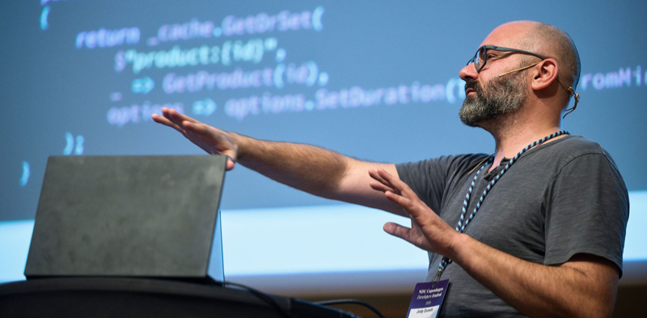

## 📺 Talks

Along the years I've been lucky enough to be invited to some conferences, shows or podcasts both online and around the world, of course to talk about all things caching and FusionCache.

Here you can find some of them, either in video form, as slides or both.

Maybe you'll find find them useful.

 

### English Language

 
 

### 📺 NDC Copenhagen (2025)

  [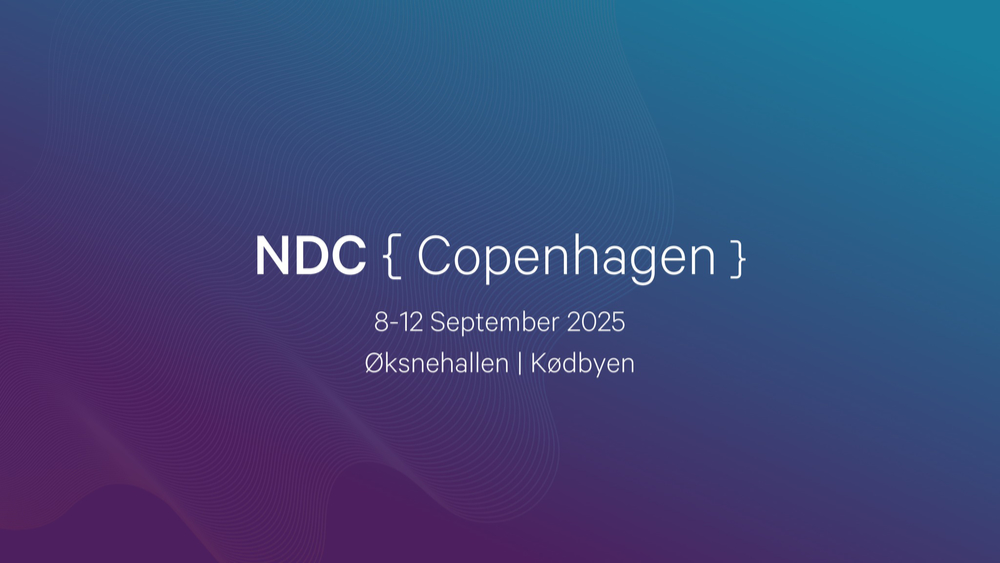](https://www.youtube.com/watch?v=kdo70GCpk6A)

I've finally been at an NDC conference, and what can I say? What a spectacular experience.

Oh, and yes: on stage it was quite hot 😅

- [🔗 video](https://www.youtube.com/watch?v=kdo70GCpk6A)
- [🔗 slides](talks/20250910-ndc-copenhagen-hybrid-caching.pdf)

 
 

### 📺 NTK (2025)

  [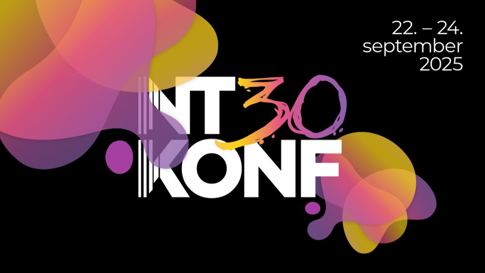](talks/20250922-ntk-hybrid-caching.pdf)

The fine folks at NTK in Slovenia have been so nice to invite me for a session on hybrid caching.

No video this time, but slides are available.

- [🔗 slides](talks/20250922-ntk-hybrid-caching.pdf)

 
 

### 📺 On .NET (2025)

  [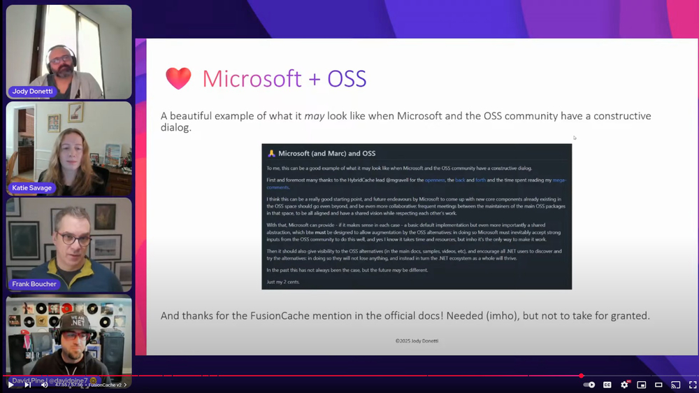](https://www.youtube.com/watch?v=3eZCtQSq9g4)

Here we go again: [On .NET](https://learn.microsoft.com/en-us/shows/on-net/) hosted me for a "one year later" episode.

I highlighted what happened since last year's episode, both in general in the world of .NET caching and in particular with FusionCache.
 
Spoiler: a lot!

- [🔗 video](https://www.youtube.com/watch?v=3eZCtQSq9g4)
- [🔗 slides](talks/20250421-on-dotnet-every-cache-a-painting-revisited.pdf)

 
 

### 📺 On .NET (2024)

  [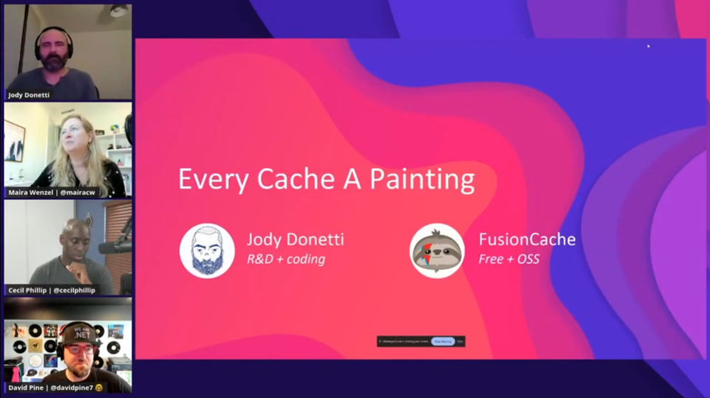](https://www.youtube.com/watch?v=hCswI2goi7s)

The fine folks at [On .NET](https://learn.microsoft.com/en-us/shows/on-net/) have been kind enough to invite me on the show and listen to me mumbling random caching stuff.

This is a very good introduction on the general approach and features of FusionCache, but also a useful overview of caching concepts in general.

- [🔗 video](https://www.youtube.com/watch?v=hCswI2goi7s)

 
 

### 📺 Open At Microsoft (2024)

  [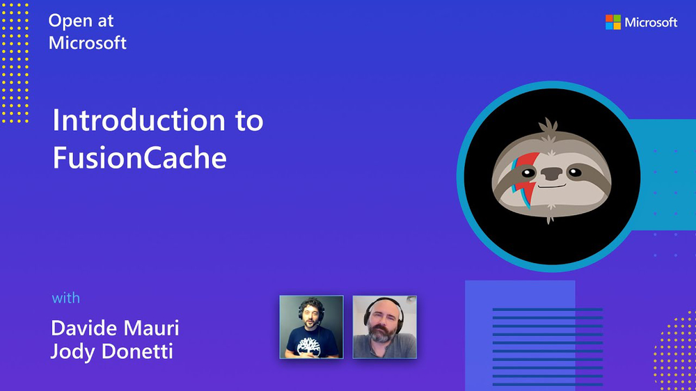](https://www.youtube.com/watch?v=wGKSNqxN4KE)

In this quick talk with [Davide Mauri](https://twitter.com/mauridb) we introduced FusionCache to the audience of Open at Microsoft.

Quick and to the point.

- [🔗 video](https://www.youtube.com/watch?v=wGKSNqxN4KE)

 
 

### 📺 Data Exposed (2022)

  [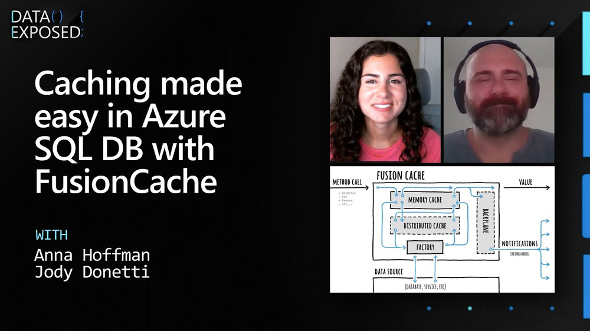](https://www.youtube.com/watch?v=V2fCUoJgVAo)

The great [Anna Hoffman](https://twitter.com/analyticanna) has been so nice to listen to me mumble random stuff about caching on [Data Exposed](https://learn.microsoft.com/en-us/shows/data-exposed/caching-made-easy-in-azure-sql-db-with-fusioncache-data-exposed).

Thanks Anna!

- [🔗 video](https://www.youtube.com/watch?v=V2fCUoJgVAo)

 

### Italian Language 🤌

 
 

### 📺 DotNetConf Liguria - Part 2 (2025)

  [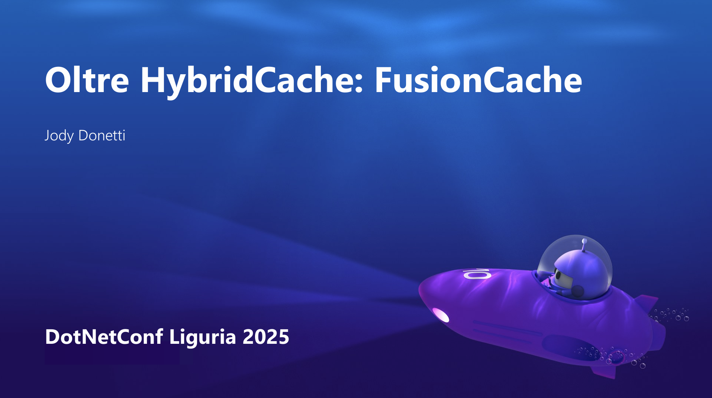](talks/20251212-dotnetconf-liguria-part-2.pdf)

The fine folks at DotNetConf Liguria have been so nice to invite me for a back-to-back combo of 2 sessions, of course on hybrid caching and FusionCache.

No video, but slides are available:

- [🔗 slides](talks/20251212-dotnetconf-liguria-part-2.pdf)

 
 

### 📺 DotNetConf Liguria - Part 1 (2025)

  [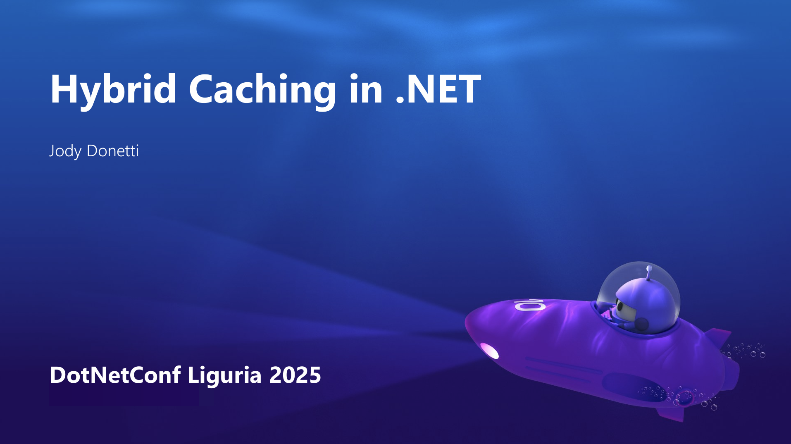](talks/20251212-dotnetconf-liguria-part-1.pdf)

The fine folks at DotNetConf Liguria have been so nice to invite me for a back-to-back combo of 2 sessions, of course on hybrid caching and FusionCache.

No video, but slides are available:

- [🔗 slides](talks/20251212-dotnetconf-liguria-part-1.pdf)

 
 

### 📺 Live Coding - Alla Scoperta Di FusionCache (2025)

  [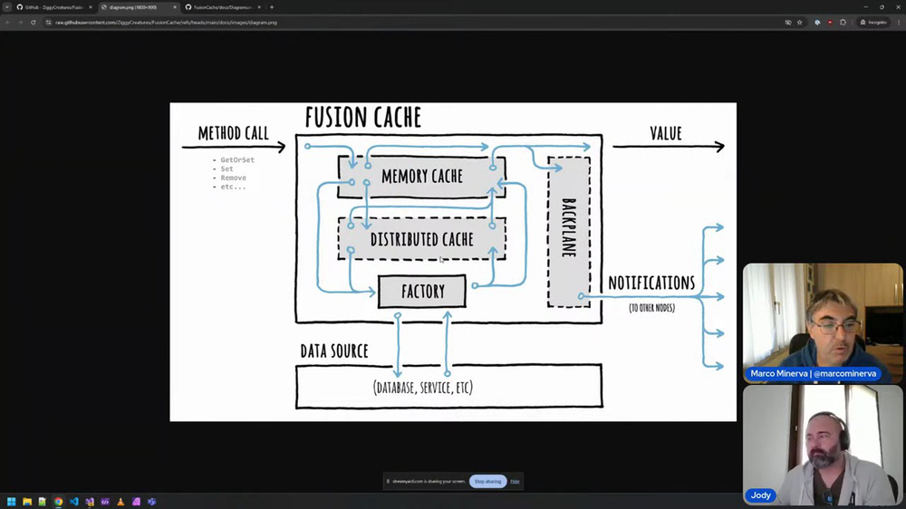](https://www.youtube.com/live/tj6w4V_cGRo)

[Marco Minerva](https://x.com/marcominerva) invited me for a talk with his viewers on all things FusionCache.

- [🔗 video](https://www.youtube.com/live/tj6w4V_cGRo)

 
 

### 📺 DotNetConf Italia (2024)

  [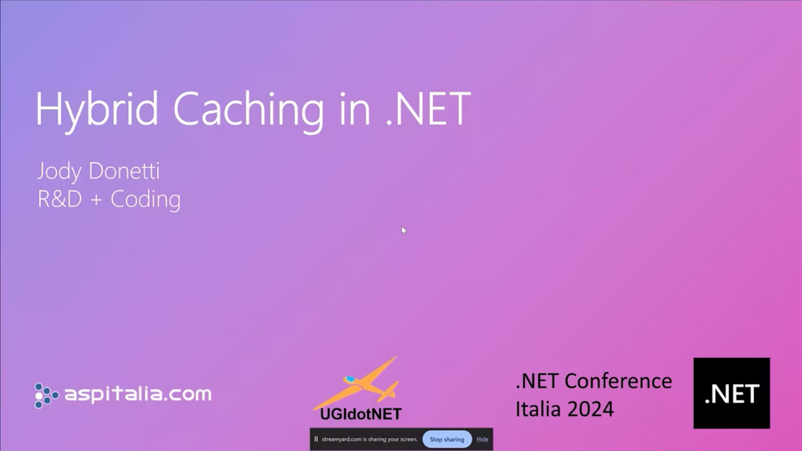](https://www.improove.tech/videos/3593/Hybrid-Caching-in-NET)

I've been lucky enough to be selected for a session at the italian version of DotNetConf, where I talked about hybrid caching in .NET, as you may have already guessed.

- [🔗 video](https://www.improove.tech/videos/3593/Hybrid-Caching-in-NET)

 
 

### 📺 Continuous Delivery (2024)

  

The fine folks at Continuous Delivery (by [SparkFabrik](https://www.sparkfabrik.com/it/)) invited me to talk about my experience with open source in general, and FusionCache in particular.

Oh, and also about Genziana and arrosticini 🙂

- [🔗 video](https://www.youtube.com/watch?v=E6PBkalmUn8)

 
 

### 📺 Spike Time (2024)

  

[Alberto Mori](https://twitter.com/albx87) invited me on his Spike Time, where I've been able to see him move his first steps with FusionCache, live, unfiltered. A really nice experience that also ended up making FusionCache even better.

Thanks Alberto!

- [🔗 video](https://www.youtube.com/watch?v=hvcHIEXzaWM)

 
 

### 📺 Small Talks (2022)

[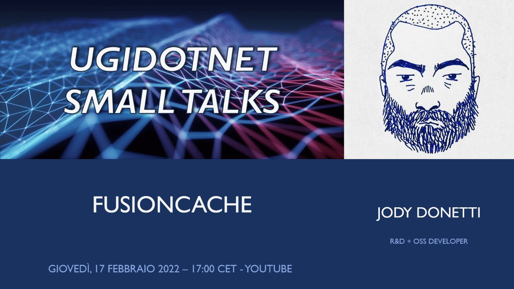](https://www.youtube.com/watch?v=DovOX0zIuJ8)

The great [Roberto Messora](https://twitter.com/robymes) invited me to UgiDotNet's show Small Talks: of course the subject was FusionCache and caching in general.

Thanks Roberto!

- [🔗 video](https://www.youtube.com/watch?v=DovOX0zIuJ8)

 
 

### 📺 dotNET{podcast} (2022)

[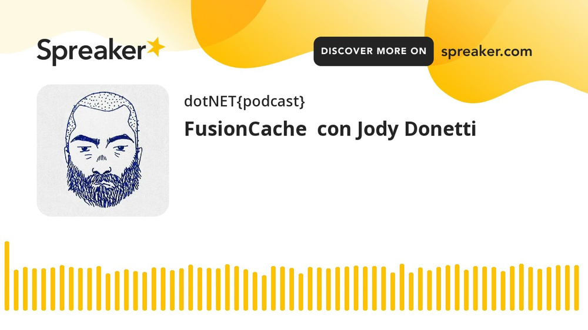](https://www.youtube.com/watch?v=TdPFULPDq-Y)

The awesome [Mauro Servienti](https://twitter.com/mauroservienti) invited me to his podcast to talk about FusionCache.

It has been a really nice talk about all things caching, thanks Mauro!

- [🔗 video](https://www.youtube.com/watch?v=TdPFULPDq-Y)

 
 

## 🧑‍🏫 Courses

If you enjoyed my talks or like the FusionCache docs, you may like this too:

[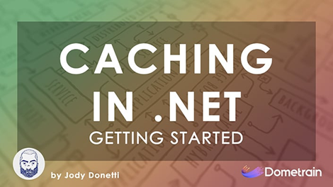](https://dometrain.com/course/getting-started-caching-in-dotnet/?ref=jody-donetti)

I published [a course](https://dometrain.com/course/getting-started-caching-in-dotnet/?ref=jody-donetti) on Dometrain.

Mind you, it's not just about FusionCache but about caching as a whole: we'll go from the very foundations to pretty advanced topics and scenarios. We'll cover performance, robustness, resiliency and we'll see different real-world problems and, most importantly, solutions for them.

I tried condensing 20+ years dealing with caching in one place, all in an approachable way.
